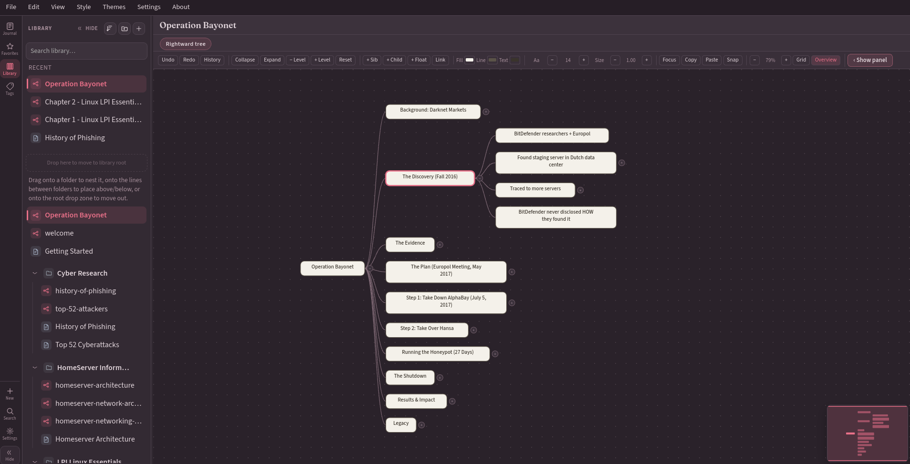
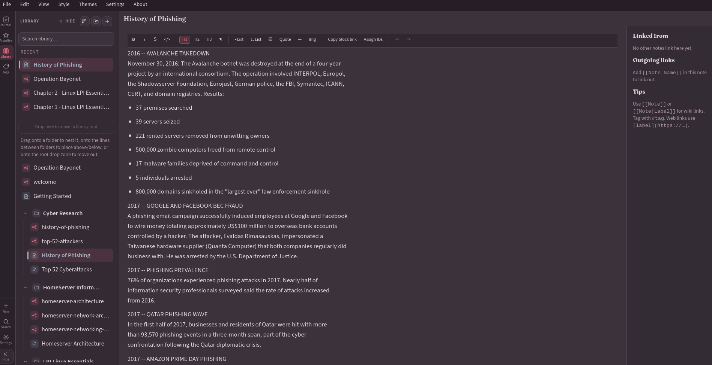
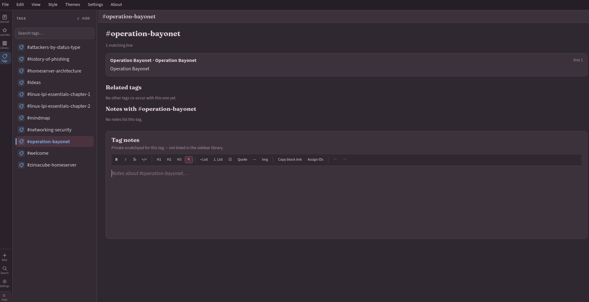
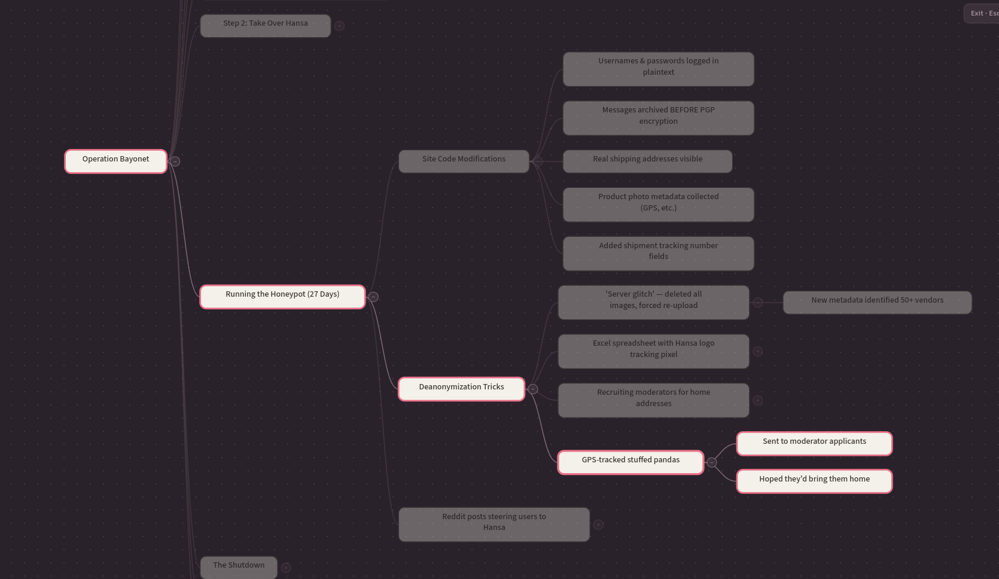
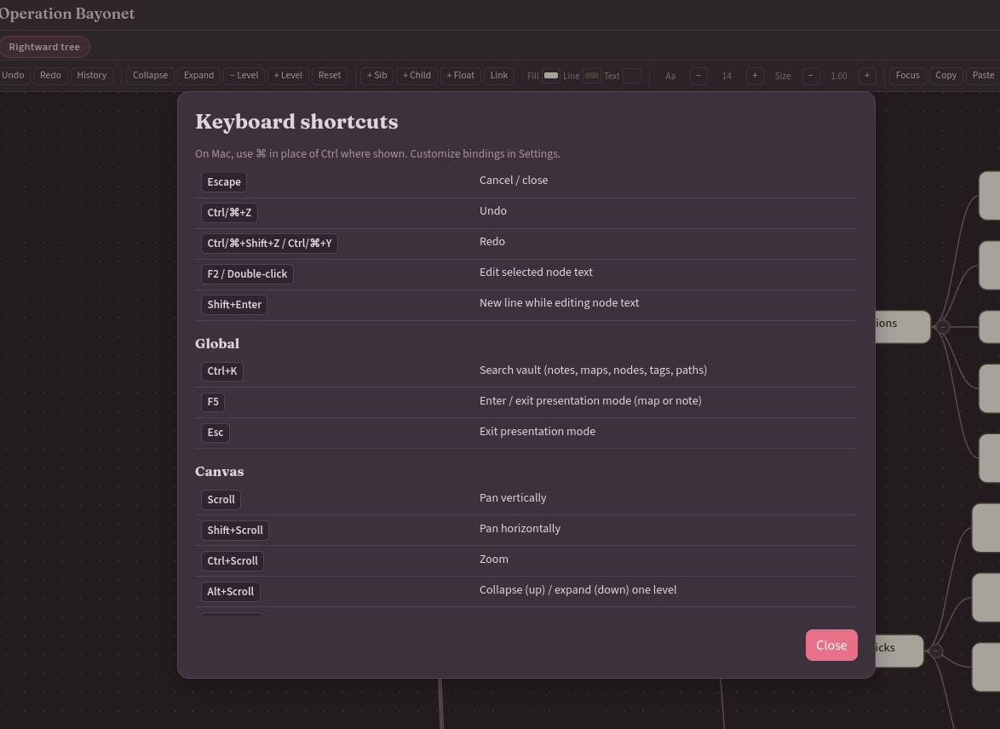

# Tabula Mentis

_map of the mind_

Local-first desktop app for mind maps + linked notes. Tauri 2, React, TypeScript.
Vaults are plain folders you own. No account, no cloud backend.

> **Status:** pre-1.0, active development. Back up vaults. See [limitations](#limitations).

## Screenshots











## What's in v0.2

- Nav rail: Journal / Favorites / Library / Tags, plus New, Search (`Ctrl+K`), Settings
- Favorites: pin maps/notes (library context menu → Add to favorites)
- Recents: last 5 opened files in Library
- Map-as-tag: each map root shows up in tags + search
- Presentation mode (`F5`): fullscreen, focus path, Esc to exit
- Stronger selected-node highlight for keyboard nav
- HTML export: visual SVG map (with embedded images) or outline
- PNG export: full map or viewport
- WikiLink suggest, backlinks, live `query` blocks in notes
- Map templates, rename, toasts/confirms, panel persistence QoL

## Features

**Vault**

- Folder-based vault, scoped native FS access
- Themes, default node styles, crash-aware writes + recovery copies

**Maps**

- Pan/zoom canvas, keyboard nav, collapse/expand
- Layouts: right, left, down, radial (+ legacy flowchart/concept still render)
- Per-node notes, images, colors, scale, typography
- Multi-select, copy/paste subtree, snap, focus selected
- Free associative links, history/undo

**Notes**

- Markdown with `[[WikiLinks]]`, `#tags`, backlinks
- Journals (continuous + day jump)
- Block IDs (`^id`), `((id))` refs, embed directives
- Safe local queries: `text` / `tag` / `page` / `map` / `property` / `task` / `status` with `AND`/`OR`/`NOT`

**Search & browse**

- Vault search: notes, maps, nodes, tags, paths (`Ctrl+K`)
- Tag browser; map roots count as tags
- Data grid view

**Import / export**

- Import: CSV, text, Freeplane `.mm`, OPML
- Export: JSON, CSV, Freeplane, OPML, PNG, HTML (visual or outline)

Plugin registry exists but is off by default (built-in adapters only; no vault JS).

## Install

Grab binaries from [Releases](https://github.com/strootle002/tabula-mentis/releases).
Treat them as **unsigned** unless notes say otherwise.

Build from source needs:

- Node.js 22 LTS (Vite wants 20.19+ or 22.12+) + npm
- Stable Rust
- [Tauri 2 prerequisites](https://v2.tauri.app/start/prerequisites/)

Ubuntu/Debian:

```bash
sudo apt-get update
sudo apt-get install -y \
  build-essential curl file libayatana-appindicator3-dev \
  librsvg2-dev libssl-dev libwebkit2gtk-4.1-dev patchelf
```

macOS: Xcode CLT. Windows: MSVC Build Tools + WebView2.

## Develop / test / build

```bash
npm ci
npm run tauri dev       # desktop
npm run dev             # frontend only

npm test
npm run lint
npm run format:check
npm run build           # frontend
npm run tauri build     # native bundles (this machine)
```

Rust:

```bash
cd src-tauri
cargo fmt --all -- --check
cargo clippy --all-targets --all-features -- -D warnings
cargo test --all-targets --all-features
cargo check --all-targets --all-features
```

Tag `v*` pushes run `.github/workflows/package.yml` (Linux, macOS arm/intel, Windows).

## Vault layout

```text
MyVault/
  .mindmap-vault-id
  maps/*.map.json
  notes/*.md
  assets/
  mindmap-meta/settings.json
```

Plus meta, recovery, journals, node-notes as needed. App prefs + trusted vault path live in OS app-data.

You own the folder. Copy/sync/version it however you like. Keep backups while pre-1.0. Don't edit the same file from two apps at once unless you want conflict cleanup.

## Security / privacy

No account or cloud. Native side grants FS access only after you pick a folder, checks the vault id, and reopens remembered paths carefully. Packaged CSP is tight.

Local-first ≠ encrypted. Vault files are plain JSON / Markdown / images. Anyone with your user account or disk can read them. No vault encryption or E2E sync yet. See [SECURITY.md](SECURITY.md).

## Limitations

- Pre-1.0 format may change
- No built-in cloud sync, realtime collab, or encryption
- Packaging is unsigned (no Apple notarization / Windows Authenticode / Linux repo signing)
- CI covers platforms; desktop quirks still want hands-on checks
- Freeplane/OPML keep hierarchy, notes, IDs, supported styles; Freeplane links kept. OPML drops canvas positions, images, cross-links. XML import rejects DTDs/entities and caps resources

## License

[MIT](LICENSE)
